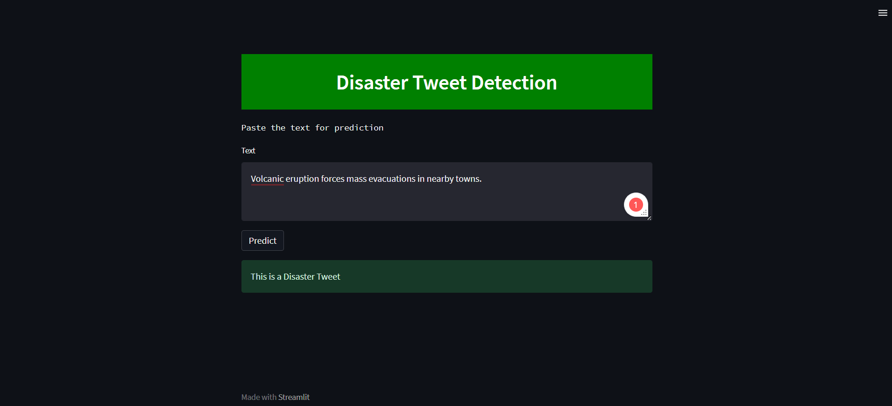

# Disaster Tweet Classification
---

This repository provides tools for classifying tweets as disaster-related or not, using machine learning and NLP techniques. It includes a Jupyter Notebook for model training and a Streamlit application for interactive testing.

## Problem Statement
-----------------

Twitter has become a valuable platform for real-time reporting during disasters, but distinguishing actual disaster-related tweets from other content is challenging. This project develops a machine learning model to identify tweets that genuinely indicate a disaster.

## Abstract
--------

Using a dataset of 10,000 labeled tweets, this project applies NLP and deep learning to classify tweets. The Universal Sentence Encoder (USE) encodes tweet text, transforming it into numerical format for a deep learning model that predicts tweet relevance. The model performance is evaluated using precision, recall, and F1 score, ensuring robust accuracy.

## Dataset Overview
----------------

The dataset includes:

*   **train.csv**: Labeled tweets (disaster-related or not).
*   **test.csv**: Unlabeled tweets for prediction.

### Key Columns:

*   **Tweet Text**: The primary feature for classification.
*   **Keyword**: Disaster-related terms (e.g., "earthquake").
*   **Location**: Indicates tweet origin, sometimes relevant for regional disasters.

## Methodology
-----------

1.  **Data Collection**: Initial dataset review revealed insights into tweet length, keyword distribution, and language variations.
2.  **Feature Engineering**:
    *   Stop word removal, tokenization, and URL stripping.
3.  **Model Selection**:
    *   **Neural Networks** with Universal Sentence Encoder embeddings were chosen for capturing non-linear relationships and providing probability-based predictions.
4.  **Model Training**:
    *   Input data preprocessed and vectorized with USE.
    *   Neural network with dense layers optimized for binary classification.
    *   Early stopping implemented to prevent overfitting.
5.  **Performance Evaluation**: Metrics used were accuracy, precision, and recall, resulting in reliable performance.

## Performance Metrics
- Accuracy: The model attains an accuracy of **89.72%**.
- Precision: The model attains precision of **90.44%**.
- Recall: The model attains recall of **85.32%**.

## Application Development
-----------------------

A Streamlit application provides an interactive interface for real-time testing. Users can input tweet text to receive disaster predictions based on the model’s probability scores.



## Installation and Running Instructions
-------------------------------------

### Prerequisites

Ensure the following are installed:

*   Python 3.10.2 or higher
*   Required Python packages (`numpy`, `pandas`, `nltk`, `scikit-learn`, `tensorflow`, `keras`, `streamlit` , `kagglehub` , `tensorflow_hub`)

### Installation Steps

1.  Clone the repository and open it in your preferred environment.
    
2.  Install dependencies:
    
    ```bash
    pip install numpy pandas nltk scikit-learn tensorflow keras streamlit
    ```
    
3.  Download NLTK resources:
    
    ```python
    import nltk
    nltk.download('stopwords')
    nltk.download('punkt')
    ```
    

### Running the Project

#### Jupyter Notebook Usage

1.  **Set Kernel**: Use Python kernel 3.10.2.
2.  **Execute Cells**: Run all cells in the notebook to complete classification.

#### Streamlit Application for Interactive Testing

1.  **Run Streamlit Application**:
    
    ```bash
    streamlit run main.py
    ```
    
2.  **Access Application**: The app will be live at [http://localhost:8501](http://localhost:8501).